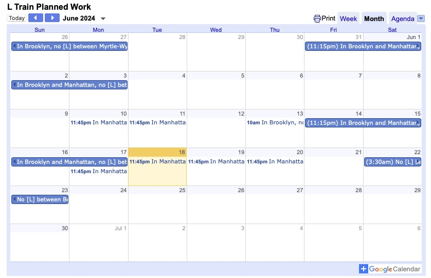

# L Train Planned Closure Calendar

This is a simple script which generates and updates a Google Calendar with the planned L Train service changes. The script uses the MTA API's [Service Alert Feed](https://api.mta.info/#/serviceAlerts) to get the planned service changes and the Google Calendar API to update the calendar.
## Instructions to Use
Calendar can be viewed [here](https://bit.ly/ViewLTrainCalendar) and instructions to add it to your own Google Calendar can be found [here](https://field-melon-1e9.notion.site/Adding-L-Train-Planned-Work-Calendar-1069f73672de4c718f82c9609e468d35?pvs=74)

## How it works
This runs in an AWS Lambda function based on the dockerfile in the repo. The function is triggered by a CloudWatch event rule which runs every 6 hours. The function checks the MTA API for planned service changes and updates the Google Calendar accordingly.